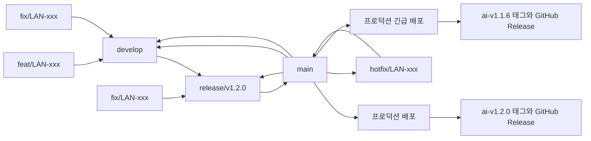

# LAN-172 AI 서버 버전 및 릴리즈 관리 설계

## 목적

Landit AI 서버의 개발 브랜치, 릴리즈 브랜치, 프로덕션 배포, 긴급 수정과 버전 기록 방식을 일관되게 관리합니다. 사람이 프로덕션 배포를 승인하고, 승인된 배포가 성공한 이후의 태그와 GitHub Release 기록은 에이전트 또는 GitHub Actions가 정해진 규칙에 따라 수행합니다.

## 기본 원칙

- `develop`은 다음 배포를 위한 개발 통합 브랜치입니다.
- `main`은 프로덕션 배포 전용 브랜치입니다. 실제 운영 버전은 `main`의 최신 상태가 아니라 마지막으로 배포에 성공한 태그를 기준으로 확인합니다.
- 프로덕션에 배포된 정확한 커밋은 Git tag로 식별합니다.
- 개별 배포의 변경 내역은 GitHub Release를 기준으로 관리합니다.
- GitHub Wiki에는 버전 정책, 배포 절차, 롤백 정책과 ADR을 기록합니다. 개별 배포 내역을 Wiki에 중복해서 작성하지 않습니다.
- 배포가 끝난 `release/*` 브랜치는 재사용하지 않습니다. 과거 배포 기록은 태그와 GitHub Release로 보존합니다.
- 프로덕션에 반영된 변경은 다음 릴리즈에서 누락되지 않도록 `main`에서 `develop`로 병합합니다.
- 브랜치 동기화에는 병합을 사용해 커밋 계보를 유지합니다. 동일한 변경을 별도 커밋으로 만드는 cherry-pick은 예외적인 복구 상황이 아니면 사용하지 않습니다.

## 브랜치 역할

| 브랜치 | 역할 | 분기 기준 | 병합 대상 |
| --- | --- | --- | --- |
| `develop` | 다음 배포를 위한 개발 통합 | 장기 유지 | `release/*` |
| `feat/{ISSUE_NUMBER}` | 신규 기능과 정책 변경 | `develop` | `develop` |
| `fix/{ISSUE_NUMBER}` | 프로덕션 배포 전 버그 수정 | 문제가 존재하는 `develop` 또는 `release/*` | 분기했던 브랜치 |
| `release/v{MAJOR}.{MINOR}.{PATCH}` | 배포 범위 동결과 최종 검증 | `develop` | `main` |
| `main` | 프로덕션 배포 전용 | 장기 유지 | 프로덕션 환경과 `develop` |
| `hotfix/{ISSUE_NUMBER}` | 현재 프로덕션의 긴급 수정 | `main` | `main` |

기존 `release/LAN-161`은 기존 방식으로 마무리합니다. LAN-172 적용 이후 새로 만드는 릴리즈 브랜치부터 `release/v1.2.0`과 같이 배포 예정 버전을 이름에 사용합니다.

## 전체 흐름



## 일반 개발과 정식 릴리즈

1. `develop`에서 `feat/{ISSUE_NUMBER}`를 생성합니다.
2. 구현과 검증을 완료한 뒤 `develop` 대상 PR을 병합합니다.
3. 배포 범위가 확정되면 배포 예정 `MAJOR.MINOR.PATCH` 버전을 확인하고 `develop`에서 `release/v{VERSION}`을 생성합니다.
4. 릴리즈 브랜치 생성 이후 신규 기능은 해당 릴리즈에 추가하지 않고 `develop`에서 다음 배포를 위해 계속 개발합니다.
5. 릴리즈 검증 중 발견된 오류는 해당 `release/*`에서 `fix/{ISSUE_NUMBER}`를 생성해 수정합니다.
6. 검증이 끝나면 `release/*`에서 `main`으로 PR을 생성합니다.
7. PR을 검토하고 `main`으로 병합합니다.
8. 사람이 수동 `workflow_dispatch`에 릴리즈 브랜치와 같은 승인된 `MAJOR.MINOR.PATCH` 버전을 입력해 실행합니다. 이 실행을 프로덕션 배포와 배포 성공 후 기록 작업에 대한 최종 승인으로 봅니다.
9. 프로덕션 배포가 성공하면 workflow가 배포된 `main` 커밋에 버전 태그를 생성합니다.
10. 같은 태그로 GitHub Release를 생성합니다.
11. `main`을 `develop`로 병합해 릴리즈 과정의 수정 사항을 반영합니다.
12. 병합과 동기화가 끝난 `release/*` 브랜치는 삭제합니다.

## 배포 전 fix

`fix/{ISSUE_NUMBER}`는 아직 프로덕션에 배포되지 않은 코드의 오류를 수정할 때 사용합니다.

개발 중 발견된 오류는 `develop`에서 분기하고 다시 `develop`로 병합합니다.

```text
develop
  └─ fix/LAN-xxx
       └─ develop
```

릴리즈 검증 중 발견된 오류는 해당 `release/*`에서 분기하고 다시 같은 릴리즈 브랜치로 병합합니다.

```text
release/v1.2.0
  └─ fix/LAN-xxx
       └─ release/v1.2.0
```

아직 프로덕션에 배포되지 않은 릴리즈를 완성하는 과정이므로 fix가 추가되더라도 예정 버전을 별도로 증가시키지 않습니다.

## 프로덕션 hotfix

`hotfix/{ISSUE_NUMBER}`는 현재 프로덕션에 배포된 버전의 긴급 오류를 수정할 때 사용합니다.

1. 현재 `main`에서 `hotfix/{ISSUE_NUMBER}`를 생성합니다.
2. 수정과 검증을 완료한 뒤 `main` 대상 PR을 생성합니다.
3. PR을 검토하고 `main`으로 병합합니다.
4. 에이전트가 마지막 배포 태그를 기준으로 다음 PATCH 버전을 제안합니다.
5. 사람이 수동 `workflow_dispatch`에 제안된 PATCH 버전을 입력해 긴급 프로덕션 배포를 승인합니다.
6. 배포 성공 후 workflow가 해당 태그와 GitHub Release를 생성합니다.
7. `main`을 `develop`로 병합합니다.
8. 진행 중인 `release/*`가 있다면 `main`의 hotfix 변경도 해당 릴리즈 브랜치에 병합합니다.

예를 들어 현재 운영 버전이 `ai-v1.1.0`이라면 hotfix 배포는 `ai-v1.1.1`이 됩니다. hotfix가 반복되어 `ai-v1.1.5`까지 배포된 뒤 하위 호환 신규 기능을 정식 배포한다면 다음 릴리즈는 `release/v1.2.0`과 `ai-v1.2.0`을 사용합니다.

## 버전 증가 기준

Semantic Versioning의 `MAJOR.MINOR.PATCH` 형식을 사용합니다.

| 변경 내용 | 증가 방식 | 예시 |
| --- | --- | --- |
| 호환되지 않는 변경 | MAJOR | `1.1.5`에서 `2.0.0` |
| 하위 호환 신규 기능 | MINOR | `1.1.5`에서 `1.2.0` |
| 운영 버그 수정과 긴급 수정 | PATCH | `1.1.5`에서 `1.1.6` |

- MAJOR 또는 MINOR가 증가하면 그보다 낮은 단위는 `0`으로 초기화합니다.
- 새로운 기능 없이 버그만 배포한다면 PATCH를 증가시킵니다.
- 릴리즈 브랜치가 아직 배포되지 않았다면 해당 브랜치에서 발생한 fix는 추가 PATCH 배포로 계산하지 않습니다.
- FE, BE, AI는 독립적으로 배포할 수 있으므로 항상 같은 버전을 사용할 필요가 없습니다.

## 태그와 GitHub Release

- AI 서버 태그는 `ai-v{MAJOR}.{MINOR}.{PATCH}` 형식을 사용합니다.
- annotated tag를 사용합니다.
- 태그는 프로덕션 배포가 성공한 정확한 `main` 커밋에 생성합니다.
- 정식 릴리즈 버전은 `release/v{VERSION}`의 버전을 사용합니다.
- hotfix 버전은 마지막으로 배포에 성공한 AI 태그의 PATCH를 하나 증가시켜 에이전트가 제안하고 workflow 입력으로 사용합니다.
- workflow는 입력 형식과 기존 태그 중복을 확인합니다.
- 배포가 실패한 커밋에는 태그를 생성하지 않습니다.
- 원격에 게시한 태그는 삭제하거나 다른 커밋으로 이동하지 않습니다.
- GitHub Release에는 버전, 배포 커밋 SHA, 배포 일시, 관련 PR과 이슈, 주요 변경 사항을 기록합니다.

## 사람 승인과 자동화 경계

프로덕션 배포 승인을 버전 생성까지 포함하는 단일 승인으로 봅니다. 정상 배포에서 태그와 GitHub Release 생성을 위해 별도 승인을 다시 요청하지 않습니다.

사람의 승인이 필요한 작업은 다음과 같습니다.

- `release/*`에서 `main`으로 향하는 PR 검토와 수동 프로덕션 배포 실행.
- `hotfix/*`에서 `main`으로 향하는 PR 검토와 수동 긴급 배포 실행.
- MAJOR 또는 MINOR 버전 결정.
- 기존 태그 삭제나 이동.
- 이전 버전으로 롤백.
- FE, BE, AI를 하나의 제품 버전으로 묶는 결정.

승인된 프로덕션 배포가 성공하면 에이전트 또는 GitHub Actions가 다음 작업을 수행할 수 있습니다.

- 배포된 커밋 SHA 확인.
- 승인된 버전에 맞는 태그 형식 검증.
- annotated tag 생성과 원격 게시.
- 같은 태그를 사용하는 GitHub Release 생성.
- `main` 변경의 `develop` 및 진행 중인 `release/*` 반영 여부 확인.

## 실패와 예외 처리

- 프로덕션 배포가 실패하면 태그와 GitHub Release를 생성하지 않습니다.
- 태그 또는 GitHub Release 생성만 실패하면 배포 성공 상태를 유지합니다. 누락된 기록은 같은 커밋을 기준으로 확인한 뒤 별도 절차로 복구합니다.
- 이미 존재하는 태그와 버전이 충돌하면 임의로 덮어쓰지 않고 사람에게 확인합니다.
- 롤백 시 기존 태그를 이동하지 않습니다. 이전 태그가 가리키는 커밋 또는 이미지로 재배포하고 롤백 사실을 별도 배포 기록에 남깁니다.
- 자동화는 태그 형식과 태그 대상 커밋의 `main` 포함 여부를 검증해야 합니다.

## 단일 기준 문서

- 이 설계는 LAN-172 구현과 검토의 단일 기준 문서입니다.
- 저장소 협업 규칙은 구현 단계에서 `CONTRIBUTING.md`와 필요한 `AGENTS.md` 항목에 반영합니다.
- 반복 가능한 배포 절차와 롤백 정책은 GitHub Wiki에 정리합니다.
- 개별 버전 변경 내역은 Wiki가 아니라 GitHub Release에 기록합니다.
